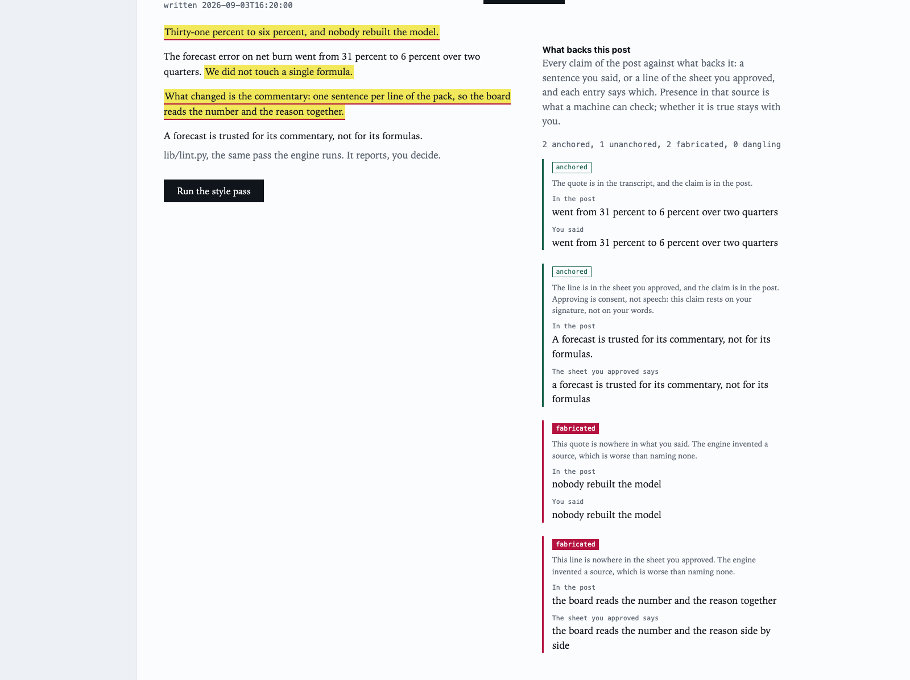
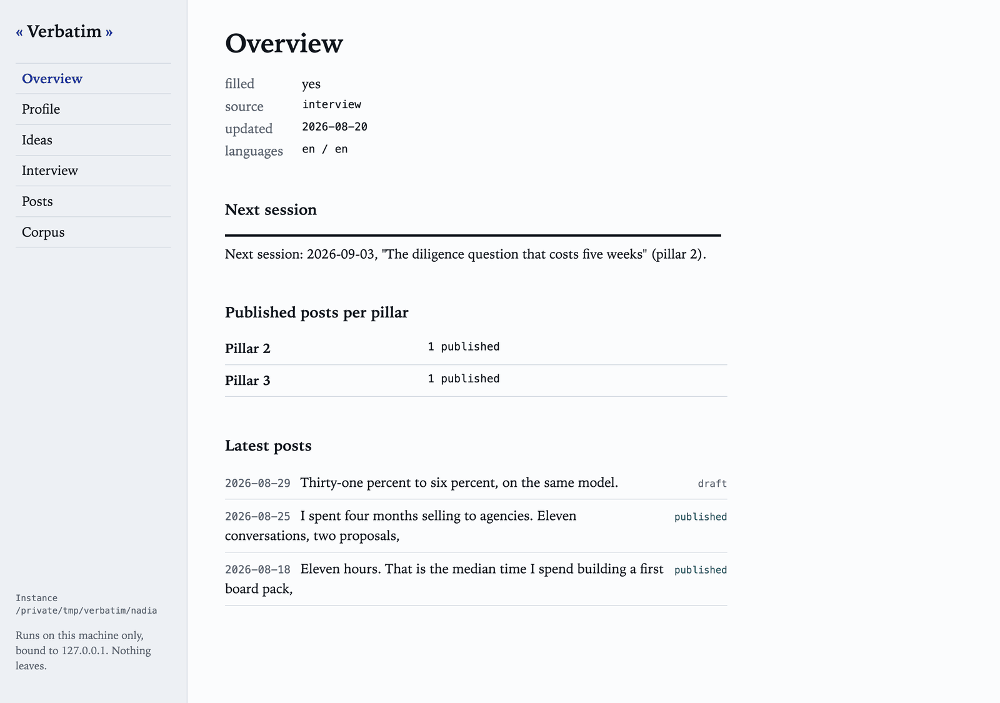
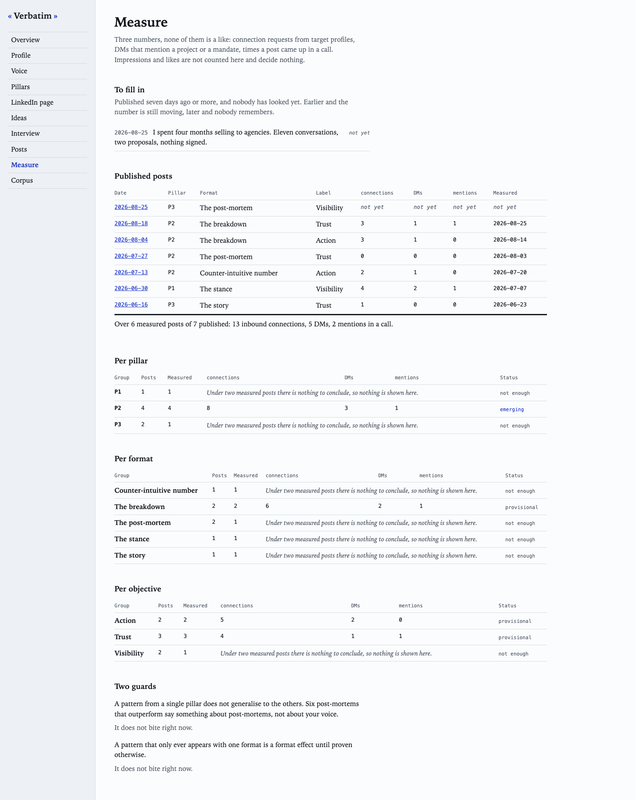
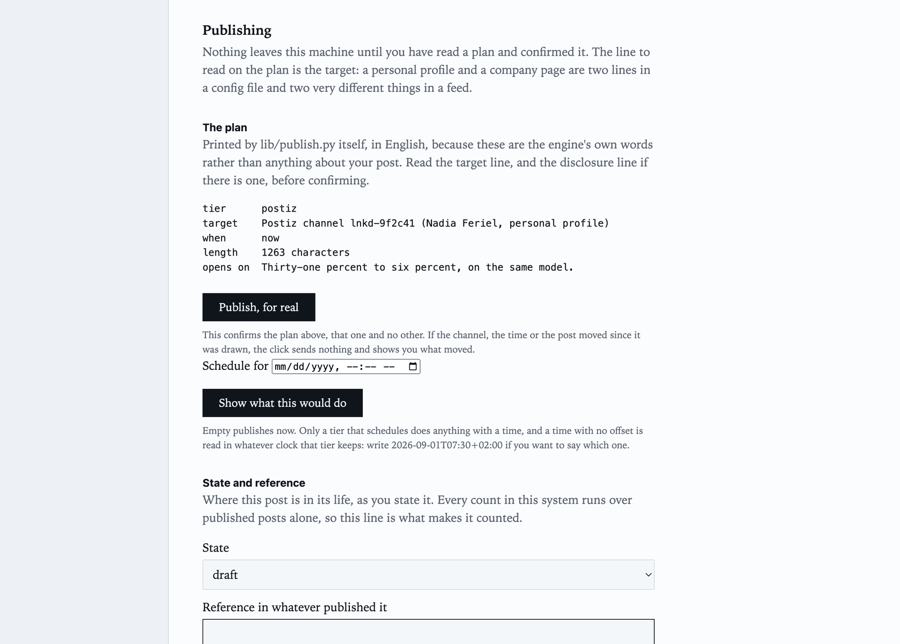

# Verbatim

**The LinkedIn post skill that interviews you first.**

A Claude skill bundle that interviews you before it writes anything, then
drafts a LinkedIn post in your voice, checks it against a language specific
style pass, archives it, and publishes it.

The name is the mechanism: no angle is proposed unless it can be traced to a
verbatim quote of something you said in the interview that produced it.

**It cannot write anything you did not say.** Every fact in a generated post
traces back to your profile, to your published corpus, or to a sentence you
spoke in the interview that produced it. When nothing traces, nothing gets
written. That constraint is the product; the writing is a consequence of it.

MIT licensed. Self hosted or no host at all. No account, no subscription, no
service in the middle.



*Every claim of a draft against what backs it, and where that backing lives:
a sentence you said, or a line of the sheet you approved. Highlighted means no
quote backs it, which is honest and is yours to check; red means the engine
named a source that does not hold the quote. The example instance in
[`examples/`](examples/) is a fictional persona; nothing here is anybody's real
material.*

A backing also says where it lives: a sentence you said, or a line of the
validation sheet you approved. The panel words the two differently, because
an approval is consent rather than speech, and a quote is checked against the
one source it names: a line of the sheet offered as something you said comes
back fabricated, and so does anything lifted from your profile.

## Why an interview

Most tools of this kind assume the hard part is writing. It is not. The hard
part is getting a specific, true, defensible thing out of your head and onto a
page, and a text box does not do that. A template does not do it either: it
produces a well shaped post about nothing, because a template can be filled
without you having said anything.

So the interview comes first, one question at a time, and it refuses to advance
on an abstract answer. It asks for the instance again: which one, when, how
many, with whom. Between four and six turns, then it stops, because the test is
whether there is a scene, a position and a consequence, not whether a counter
reached six.

Then, before a single line is drafted, it hands you a validation sheet where
every bullet has to trace to something you said. You approve it or you correct
it. Nothing is written until you do.

## Two ways to run it

**As a skill bundle**, inside Claude Code or any agent that reads skills. You
talk, it interviews you, it writes the files. This is the original shape and
it needs no Python at all.

**As a local web app**, `verbatim`, which drives the same skills against the
same directory and gives you screens for the parts that are decisions rather
than conversation: the validation sheet you approve, the traceability panel
above, the archive form, the publish plan. It also edits the files one
section at a time, keeps the idea bank, and reads the measurement store
across posts: what is due at J+7, sums per pillar, format and objective,
and the status of every pattern at the thresholds of
[`references/measure.md`](references/measure.md), with nothing averaged. It
binds to 127.0.0.1 and nothing about it is hosted.

```bash
uvx verbatim-linkedin ~/my-profile     # or: pipx install verbatim-linkedin
```

From a clone, which is also how you get the skills, it is one command and no
install:

```bash
uv run --project app verbatim ~/my-profile
```

Either way it opens on the conformance report if that directory is not a
profile yet, and tells you to run `linkedin-setup` first.

The two are the same engine over the same files. Use whichever you are in
front of; a directory written by one is read by the other.



## Engine and profile

Two things, kept apart on purpose.

**The engine** is this repository. It holds mechanism: the interview ladder,
the formats, the validation sheet, the measurement schema, the deterministic
style pass. It contains nothing about any particular person.

**The profile** is yours. Your positioning, your pillars, your provable facts,
the names you cannot cite, your signature. It lives in a directory you choose,
on your machine, and `.gitignore` here is written to make sure it never ends up
in this repository by accident.

The seam between them is three lines at the top of your profile:

```
## Status
- filled: no
- source: template
- updated: --
```

While `filled: no`, every skill falls back to generic rules, says so, and
offers to set you up. No skill pretends to know you.

## Getting started

```bash
git clone https://github.com/alexis-morain/verbatim-linkedin.git ~/verbatim-linkedin
ln -s ~/verbatim-linkedin ~/.claude/skills/verbatim
```

**The bundle installs as one unit.** The router at the root dispatches to the
skills inside it, and that is what lets every skill resolve `references/`,
`locales/` and `lib/` by the same relative path. Symlinking a single skill
directory on its own will break those paths.

Then say you want to set up your LinkedIn profile.
`linkedin-setup` runs about twenty minutes and ends on a written post, not on a
folder.

The app runs from the clone you just made:

```bash
uv run --project app verbatim ~/my-profile
```

It needs a model to run an interview, and it is told which one by three
environment variables rather than by an account. Before the first turn it
shows an order of magnitude for four to six turns at the model's input rate,
and says on the same line what that figure rests on. `.env.example` documents them.
Local and hosted are the same code path and neither is the recommended one:
what decides is whether the model can hold a 6400 token system block, answer a
forced tool call, and produce a five field validation sheet when asked.
[`docs/smoke.md`](docs/smoke.md) carries the measurements and says plainly what
the first release ships untested.

Read [`examples/`](examples/) first if you want to see the shape of a filled
profile before you fill your own. The persona in there is fictional and is
deliberately not in the maintainer's field.

## What ships

| Skill | Does |
|---|---|
| [`linkedin-setup`](skills/linkedin-setup/) | Builds your profile, your pillars, your voice file and your idea bank from a short interview, then hands over to the first post. |
| [`linkedin-post`](skills/linkedin-post/) | Interview, validation sheet, draft, style pass, revisions, archive, publish, measure at J+7. |
| [`linkedin-profile`](skills/linkedin-profile/) | Audits and rewrites the nine sections of your public LinkedIn page, headline and About first, from material you can prove. |
| [`verbatim`](app/) | The local app: the same skills, driven from screens, over the same directory. |

One more is deliberately held back: a measurement skill that advises on the
store across posts. The app's Measure screen computes what the files say; the
skill would say what it means, and it waits for real measured posts to be
built against, because advice written from imagined data measures the
imagination.



Under two measured posts, that screen concludes nothing and says so on the
line. Nothing on it is an average.

## Languages

Three axes, and they are independent:

- The **engine** is in English. Once, by the maintainer.
- The **interview** happens in your language.
- The **output** is per post, defaulting to the interview language.

The last two really are separate. Plenty of people want to be interviewed in
their own language and publish in English.

`en` and `fr` ship today. A language pack is four files, and it is **never a
translation of another pack**: the ten categories in
[`references/style-taxonomy.md`](references/style-taxonomy.md) are shared, the
word lists that fill them are not. `scalable` is a marketing tell in French and
an ordinary word in English. "Force est de constater" has no English twin.
Negative parallelism is the dominant English tell of 2026 and merely common in
French.

The contract and the acceptance criteria are in
[`locales/_template/README.md`](locales/_template/README.md). You do not have
to be a maintainer to propose a pack; you have to be a native speaker who
publishes in the language.

## The style pass

`lib/lint.py` is deterministic. No model, no network, no AI detector.

```bash
python3 lib/lint.py --lang fr - < draft.txt
```

It reports and the human decides. Only the rules a pack marks hard block a
draft, and that set is deliberately tiny. A flagged word that you actually said,
inside a quote, stays in.

It runs on the standard library alone. PyYAML is used when it is installed and
a small built-in reader takes over when it is not.

## Publishing

Three tiers. The default needs no configuration.

| `LINKEDIN_PUBLISH` | Does |
|---|---|
| `copy` (default) | Prints the post, ready to paste. Nothing leaves your machine. |
| `postiz` | Self hosted [Postiz](https://postiz.com). Needs `POSTIZ_INTEGRATION_ID`. |
| `command` | Runs your own binary, post on stdin. `LINKEDIN_PUBLISH_CMD`. |

Anything that leaves the machine needs `--confirm`, and without it the script
prints the target channel and stops. That guard exists because the maintainer
has already published to the wrong channel: a personal profile and a company
page are two lines in a config file and two very different things in a feed.

In the app the same guard is two clicks with a reading between them. You draw
a plan, which is `lib/publish.py` printing what would happen, and the confirm
button carries a digest of exactly that plan: if the channel, the time or the
post moved since it was drawn, the click sends nothing and shows you what
moved. A plan is confirmed once, so a reload or a double click cannot make two
posts out of one.



A post carrying a link gets one more line, asking whether it needs a
disclosure. Nothing here decides that for you, because nothing here can know
whether there is a material connection behind a link. What is mechanical is
that a post with no link never raises the question. The wording that satisfies
your market is in `locales/<lang>/market.md`, and the reason this exists at all
is that a disclosure once survived a draft here and not the published version.

**Publishing does not set the state of a post.** A tier accepting something is
not the same fact as a post being live: the copy tier printed a post nobody
has pasted yet, and a scheduling payload still has to be sent by whatever holds
the account. `state` and `published_ref` are yours to write, on the same
screen, exactly like the pillar and the format the archive form asks for rather
than guesses.

## What this will not do

- **No hook formulas calibrated on a viral corpus.** They invert the mechanism.
  Here the angle descends from a sentence you said; there it descends from a
  shape that performed for somebody else.
- **No writing against an AI detector.** Optimising for a classifier is writing
  for the classifier.
- **No engagement pods, no comment gate by default.**
- **No invented facts, including inside a revision.** Revisions are where this
  usually breaks, so the traceability check runs again after every one.

## License

MIT. See [LICENSE](LICENSE).
